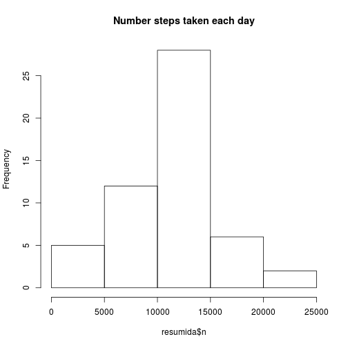

Course Project 1


Course project 1 for the course 

**Loading and preprocessing the data**

Show any code that is needed to  
1.	Load the data (i.e. read.csv())  
2.	Process/transform the data (if necessary) into a format suitable for your analysis


```r
library(dplyr)
```

```
## 
## Attaching package: 'dplyr'
```

```
## The following objects are masked from 'package:stats':
## 
##     filter, lag
```

```
## The following objects are masked from 'package:base':
## 
##     intersect, setdiff, setequal, union
```

```r
#activity <- read.csv("/media/alex/Lexar/course project/activity.csv")

fitxer <- tempfile()
download.file("https://d396qusza40orc.cloudfront.net/repdata%2Fdata%2Factivity.zip", fitxer)


# unzip the file to the temporary directory
unzip(fitxer, overwrite=TRUE)

# load the csv in data frame
activity <- read.csv("activity.csv")
```

**What is mean total number of steps taken per day?**

For this part of the assignment, you can ignore the missing values in the dataset.  
1.  Calculate the total number of steps taken per day  
2.	If you do not understand the difference between a histogram and a barplot, research the difference between them. Make a histogram of the total number of steps taken each day  
3.	Calculate and report the mean and median of the total number of steps taken per day  


```r
resumida<-activity%>%
  group_by(date)%>%
  summarise(n=sum(steps))
cat("First lines of total number of steps taken per day")
```

```
## First lines of total number of steps taken per day
```

```r
resumida
```

```
## Source: local data frame [61 x 2]
## 
##          date     n
##        (fctr) (int)
## 1  2012-10-01    NA
## 2  2012-10-02   126
## 3  2012-10-03 11352
## 4  2012-10-04 12116
## 5  2012-10-05 13294
## 6  2012-10-06 15420
## 7  2012-10-07 11015
## 8  2012-10-08    NA
## 9  2012-10-09 12811
## 10 2012-10-10  9900
## ..        ...   ...
```

```r
hist(resumida$n, main="Number steps taken each day")
```



```r
cat("First lines of Mean and median of the total number of steps taken per day")
```

```
## First lines of Mean and median of the total number of steps taken per day
```

```r
resumida2<-activity%>%
  group_by(date)%>%
  filter(!is.na(steps))%>%
  summarise(n=sum(steps),mean=mean(steps),median=median(steps))

resumida2
```

```
## Source: local data frame [53 x 4]
## 
##          date     n     mean median
##        (fctr) (int)    (dbl)  (dbl)
## 1  2012-10-02   126  0.43750      0
## 2  2012-10-03 11352 39.41667      0
## 3  2012-10-04 12116 42.06944      0
## 4  2012-10-05 13294 46.15972      0
## 5  2012-10-06 15420 53.54167      0
## 6  2012-10-07 11015 38.24653      0
## 7  2012-10-09 12811 44.48264      0
## 8  2012-10-10  9900 34.37500      0
## 9  2012-10-11 10304 35.77778      0
## 10 2012-10-12 17382 60.35417      0
## ..        ...   ...      ...    ...
```


**What is the average daily activity pattern?**  
1.  Make a time series plot (i.e. type = "l") of the 5-minute interval (x-axis) and the average number of steps taken, averaged across all days (y-axis)  
2.	Which 5-minute interval, on average across all the days in the dataset, contains the maximum number of steps?  


```r
resumida3<-activity%>%
  group_by(interval)%>%
  filter(!is.na(steps))%>%
  summarise(n=sum(steps),mean=mean(steps),median=median(steps))

plot(resumida3$interval, resumida3$mean, type='l',  
     main="Average number of steps per 5 minutes period",xlab="5 minute interval",ylab="Mean")
```


```r
cat("5-minute interval with the maximum number of steps")
```

```
## 5-minute interval with the maximum number of steps
```

```r
resumida3$interval[which.max(resumida3$n)]
```

```
## [1] 835
```

**Imputing missing values**  
Note that there are a number of days/intervals where there are missing values (coded as NA). The presence of missing days may introduce bias into some calculations or summaries of the data.  
  
1.  Calculate and report the total number of missing values in the dataset (i.e. the total number of rows with NAs)  
2.	Devise a strategy for filling in all of the missing values in the dataset. The strategy does not need to be sophisticated. For example, you could use the mean/median for that day, or the mean for that 5-minute interval, etc.  
3.	Create a new dataset that is equal to the original dataset but with the missing data filled in.  
4.	Make a histogram of the total number of steps taken each day and Calculate and report the mean and median total number of steps taken per day. Do these values differ from the estimates from the first part of the assignment? What is the impact of imputing missing data on the estimates of the total daily number of steps?  


```r
activity%>%
  summarise (number_of_NA=sum(is.na(steps)))
```

```
##   number_of_NA
## 1         2304
```

```r
activity_imputed<-activity
for (i in 1:nrow(activity_imputed))
{
  if (is.na(activity_imputed$steps[i]))
      {
        activity_imputed$steps[i]<-resumida3$mean[which(resumida3$interval ==activity_imputed$interval[i])]
        
      }
}


resumida_imputed<-activity_imputed%>%
  group_by(date)%>%
  summarise(n=sum(steps))
cat("First lines of total number of steps taken per day with imputated values")
```

```
## First lines of total number of steps taken per day with imputated values
```

```r
resumida_imputed
```

```
## Source: local data frame [61 x 2]
## 
##          date        n
##        (fctr)    (dbl)
## 1  2012-10-01 10766.19
## 2  2012-10-02   126.00
## 3  2012-10-03 11352.00
## 4  2012-10-04 12116.00
## 5  2012-10-05 13294.00
## 6  2012-10-06 15420.00
## 7  2012-10-07 11015.00
## 8  2012-10-08 10766.19
## 9  2012-10-09 12811.00
## 10 2012-10-10  9900.00
## ..        ...      ...
```

```r
hist(resumida_imputed$n, main="Number steps taken each day(imputated values)")
```


```r
cat("First lines of Mean and median of the total number of steps taken per day with imputated values")
```

```
## First lines of Mean and median of the total number of steps taken per day with imputated values
```

```r
resumida2_imputed<-activity_imputed%>%
  group_by(date)%>%
  filter(!is.na(steps))%>%
  summarise(n=sum(steps),mean=mean(steps),median=median(steps))

resumida2_imputed
```

```
## Source: local data frame [61 x 4]
## 
##          date        n     mean   median
##        (fctr)    (dbl)    (dbl)    (dbl)
## 1  2012-10-01 10766.19 37.38260 34.11321
## 2  2012-10-02   126.00  0.43750  0.00000
## 3  2012-10-03 11352.00 39.41667  0.00000
## 4  2012-10-04 12116.00 42.06944  0.00000
## 5  2012-10-05 13294.00 46.15972  0.00000
## 6  2012-10-06 15420.00 53.54167  0.00000
## 7  2012-10-07 11015.00 38.24653  0.00000
## 8  2012-10-08 10766.19 37.38260 34.11321
## 9  2012-10-09 12811.00 44.48264  0.00000
## 10 2012-10-10  9900.00 34.37500  0.00000
## ..        ...      ...      ...      ...
```

Values differ when we imputed new values in median values. The imputed values were done with the mean of each interval and the mean values has no modifications.


  
  
  
**Are there differences in activity patterns between weekdays and weekends?**  
For this part the weekdays() function may be of some help here. Use the dataset with the filled-in missing values for this part.  
1.	Create a new factor variable in the dataset with two levels – “weekday” and “weekend” indicating whether a given date is a weekday or weekend day.  
2.	Make a panel plot containing a time series plot (i.e. type = "l") of the 5-minute interval (x-axis) and the average number of steps taken, averaged across all weekday days or weekend days (y-axis). See the README file in the GitHub repository to see an example of what this plot should look like using simulated data.  ,


```r
activity_imputed$day <- ifelse((weekdays(as.Date(activity_imputed$date))=="dissabte" | weekdays(as.Date(activity_imputed$date))=="diumenge"),"weekend", "weekday")

activity_imputed$day<-as.factor(activity_imputed$day)


resumida4<-activity_imputed%>%
  group_by(interval,day)%>%
  filter(!is.na(steps))%>%
  summarise(n=sum(steps),mean=mean(steps),median=median(steps))

library(ggplot2)

qplot(interval, mean, data=resumida4, geom=c("line"), xlab=" 5 minute interval", 
      ylab="Mean", main="Average number of steps per 5 minutes period") + facet_wrap(~ day, ncol=1)
```


